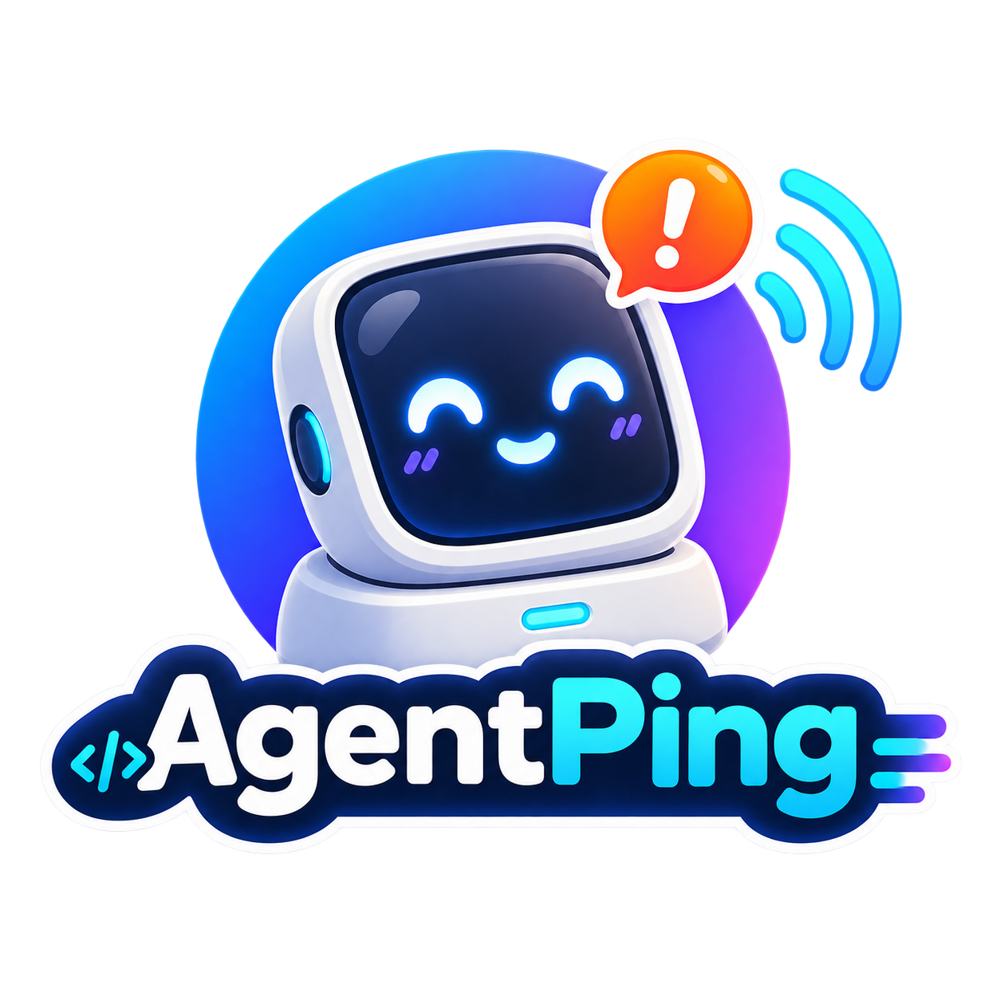

<p align="center">
  
</p>

# AgentPing

**A tiny desk-side inbox for AI coding agents.**

AgentPing is an early, buildable foundation for a Windows/.NET bridge and a Waveshare ESP32-C6 Touch AMOLED 1.64 display. The long-term product is a physical notification and response surface for coding agents. The current repository intentionally implements only the baseline described below.

## What works today

### Bridge

- ASP.NET Core 10 executable with structured JSON console logging
- loopback-only default listener at `http://127.0.0.1:8742`
- `GET /health` liveness endpoint
- `GET /api/status` minimal, non-secret baseline status
- integration tests and a process-level smoke test
- reproducible Docker image build

### Firmware

- pinned PlatformIO/ESP-IDF ESP32-C6 project
- compile-tested structured heartbeat skeleton
- schema-derived protocol-v1 constants compiled into the firmware
- no hardcoded network or provider credentials

### Protocol contract

- JSON Schema Draft 2020-12 contract for all nine v1 message kinds
- bounded envelopes, revisioned/idempotent actions, version negotiation, and reconnect/resume rules
- LAN threat model and full-entropy token pairing/rotation/revocation design
- golden valid/fail-closed fixtures consumed by Python validation and bridge serialization tests

The firmware does **not** initialize the display, touch, Wi-Fi, TLS, pairing, LVGL, or protocol transport yet. The bridge does **not** implement provider adapters, device pairing, WebSockets, approvals, persistence, or tray UI yet. The protocol artifacts are a tested contract, not runtime networking evidence. See the open issues for dependency-ordered implementation work.

## Repository layout

```text
bridge/       ASP.NET Core bridge and tests
firmware/     ESP32-C6 PlatformIO skeleton
protocol/     shared machine-readable protocol schema, fixtures, and validator
hardware/     hardware scope and future editable KiCad sources
docs/         architecture and protocol status
integration/  process-level integration tooling
scripts/      canonical local verification command
```

## Build and test the bridge

Requires the .NET 10 SDK.

```bash
dotnet restore AgentPing.sln --locked-mode
dotnet build AgentPing.sln --configuration Release --no-restore
dotnet test AgentPing.sln --configuration Release --no-build
./integration/smoke-bridge.sh
```

Run the service:

```bash
dotnet run --project bridge/AgentPing.Bridge
curl http://127.0.0.1:8742/health
curl http://127.0.0.1:8742/api/status
```

Expected health response: `Healthy`. The status JSON identifies `agentping-bridge`, reports `status: ok`, and uses `apiVersion: baseline-v0` because the device transport is not implemented. Protocol-v1 schema/models existing in the repository do not change that runtime truth.

## Build the firmware

```bash
python3 -m venv .venv-platformio
. .venv-platformio/bin/activate
python3 -m pip install --requirement firmware/requirements-ci.txt
python3 -m pip install --requirement protocol/requirements-ci.txt
python3 protocol/validate.py
platformio run -d firmware
```

A successful compile is static evidence only. Flashing, display, touch, Wi-Fi, and physical bench behavior are not CI-validated. See [`firmware/README.md`](firmware/README.md).

## Container build

```bash
docker build --file bridge/AgentPing.Bridge/Dockerfile --tag agentping-bridge:local .
docker run --rm -p 127.0.0.1:8742:8742 agentping-bridge:local
```

The container listens on `0.0.0.0:8742` inside its isolated network namespace so Docker can forward traffic; the documented host publish is explicitly restricted to `127.0.0.1`.

## Architecture and protocol

The ESP32 remains a thin client; GitHub/OpenAI/Anthropic credentials stay on the PC. The bridge binds to loopback by default until the specified authenticated LAN pairing and TLS transport are implemented.

- [`docs/architecture.md`](docs/architecture.md) describes current and planned boundaries.
- [`docs/protocol.md`](docs/protocol.md) specifies protocol v1, secure pairing, compatibility, ordering, resume, and fail-closed action rules.
- [`hardware/README.md`](hardware/README.md) states the current hardware evidence and future KiCad scope.

## Contributing and security

See [`CONTRIBUTING.md`](CONTRIBUTING.md) for exact verification commands and [`SECURITY.md`](SECURITY.md) for private vulnerability reporting and trust-boundary requirements.

## License

MIT. See [`LICENSE`](LICENSE).
