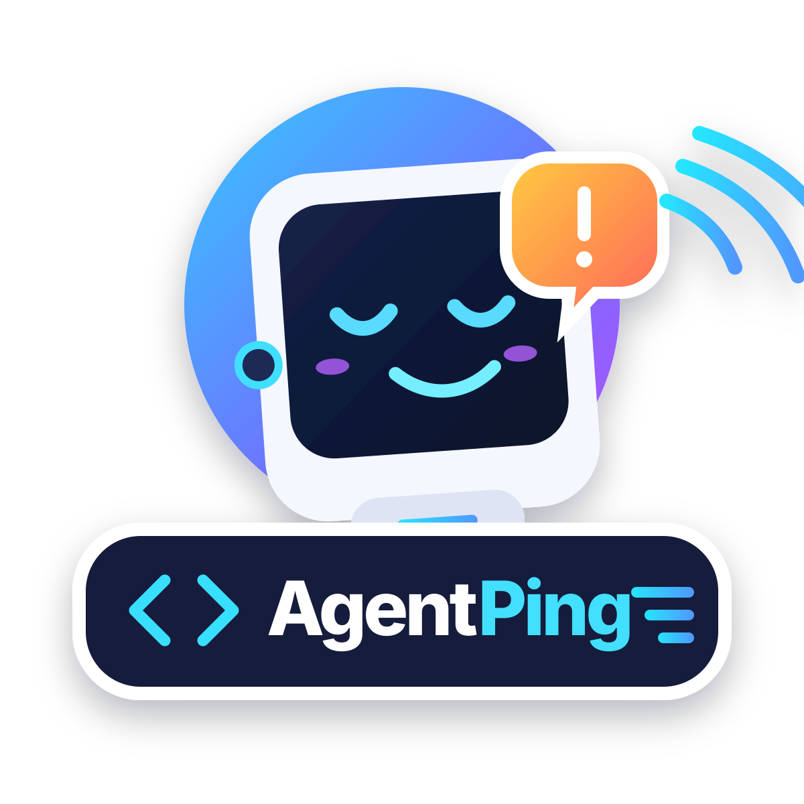

<p align="center">
  
</p>

# AgentPing

**A tiny desk-side inbox for AI coding agents.**

AgentPing turns an ESP32-C6 AMOLED touch display into a physical notification and response surface for coding agents such as GitHub Copilot, Codex, and Claude Code.

The project has two parts:

- **AgentPing Bridge** — a small Windows/.NET service that receives agent events, tracks sessions and attention requests, and relays state to devices.
- **AgentPing Display** — firmware for the Waveshare ESP32-C6 1.64-inch 280×456 AMOLED touch board.

```text
Copilot / Codex / Claude
          |
          | hooks / local APIs
          v
+-------------------------+
| AgentPing Bridge        |
| Windows / .NET          |
|                         |
| events + approvals      |
| unified session state   |
| WebSocket server        |
+------------+------------+
             |
             | Wi-Fi / WebSocket
             v
+-------------------------+
| ESP32-C6 AgentPing      |
| 280x456 AMOLED + touch  |
|                         |
| status / alerts / reply |
+-------------------------+
```

## Current status

This repository is an early working scaffold.

### Bridge

- [x] ASP.NET Core service on port `8742`
- [x] Normalized agent/session state
- [x] `GET /api/status`
- [x] `POST /api/events`
- [x] WebSocket device feed at `/ws`
- [x] Approval broker endpoints for future hook integration
- [ ] GitHub Copilot adapter
- [ ] Codex adapter
- [ ] Claude Code adapter
- [ ] Windows tray UI / installer

### Display

- [x] Waveshare-specific firmware skeleton
- [x] Wi-Fi + WebSocket connection model
- [x] LVGL status screen skeleton
- [ ] touch actions
- [ ] approval / deny UI
- [ ] custom reply keyboard
- [ ] OTA updates
- [ ] haptics / sounds

## Run the bridge

Requires the .NET 10 SDK.

```powershell
dotnet run --project bridge/AgentPing.Bridge
```

Then test it:

```powershell
Invoke-RestMethod http://localhost:8742/api/status
```

Send a fake agent event:

```powershell
$body = @{
  provider = "codex"
  sessionId = "demo-1"
  sessionName = "AgentPing demo"
  state = "waiting_for_user"
  message = "Should I run the tests?"
  attention = $true
} | ConvertTo-Json

Invoke-RestMethod `
  -Method Post `
  -Uri http://localhost:8742/api/events `
  -ContentType application/json `
  -Body $body
```

## Hardware target

Initial firmware targets the **Waveshare ESP32-C6 Touch AMOLED 1.64** board:

- ESP32-C6
- 280 × 456 AMOLED
- capacitive touch
- Wi-Fi 6 / BLE
- LVGL

Waveshare's Arduino example currently uses Arduino-ESP32 3.2.0 and LVGL 8.4.0. The firmware folder intentionally keeps AgentPing application code separate from the vendor display/touch BSP so we can track upstream board support cleanly.

## Protocol

The ESP32 is intentionally a thin client. Credentials for GitHub/OpenAI/Anthropic stay on the PC.

See [`docs/protocol.md`](docs/protocol.md) for the device protocol and [`docs/architecture.md`](docs/architecture.md) for the overall design.

## Security model

The intended design is LAN-only by default:

- no GitHub/OpenAI/Anthropic secrets on the ESP32
- bridge binds to the local machine/LAN
- devices authenticate to the bridge with a device token
- destructive approvals will require explicit confirmation

## Roadmap

1. Make the bridge + ESP32 status feed work end-to-end.
2. Add Copilot, Codex, and Claude hooks for notifications.
3. Add synchronous approval/deny flows.
4. Add short text replies.
5. Add a Windows tray app and automatic discovery/pairing.
6. Add voice/haptics as optional hardware extensions.

## License

MIT. See [`LICENSE`](LICENSE).
