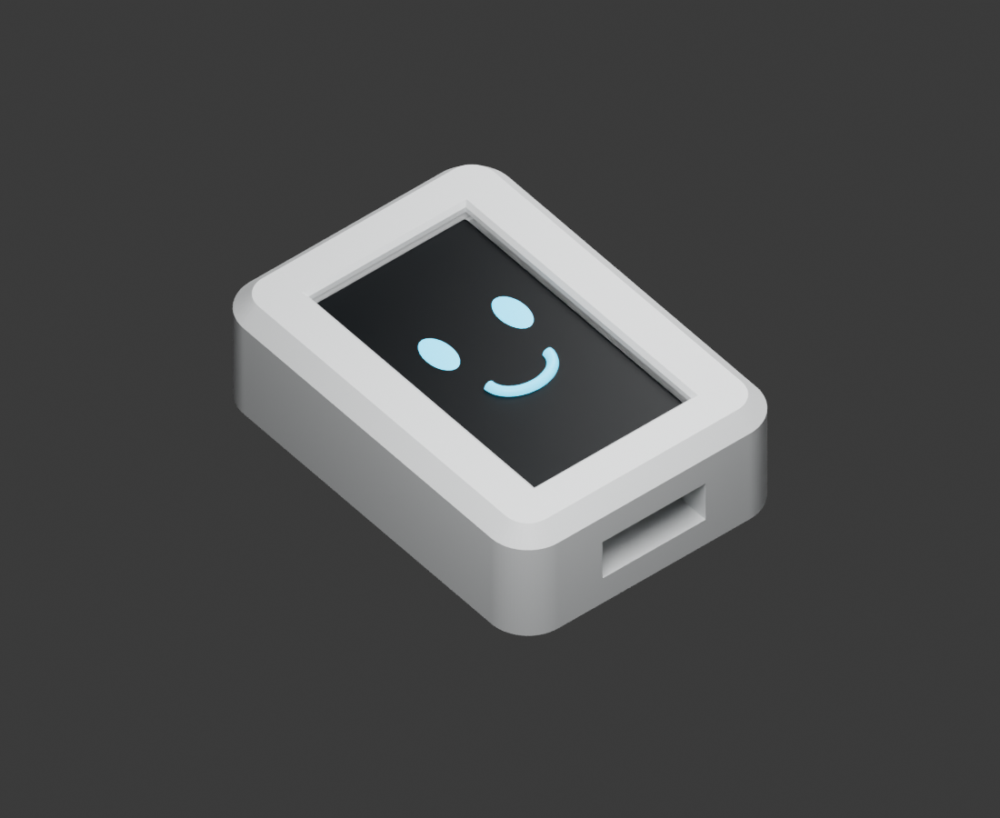
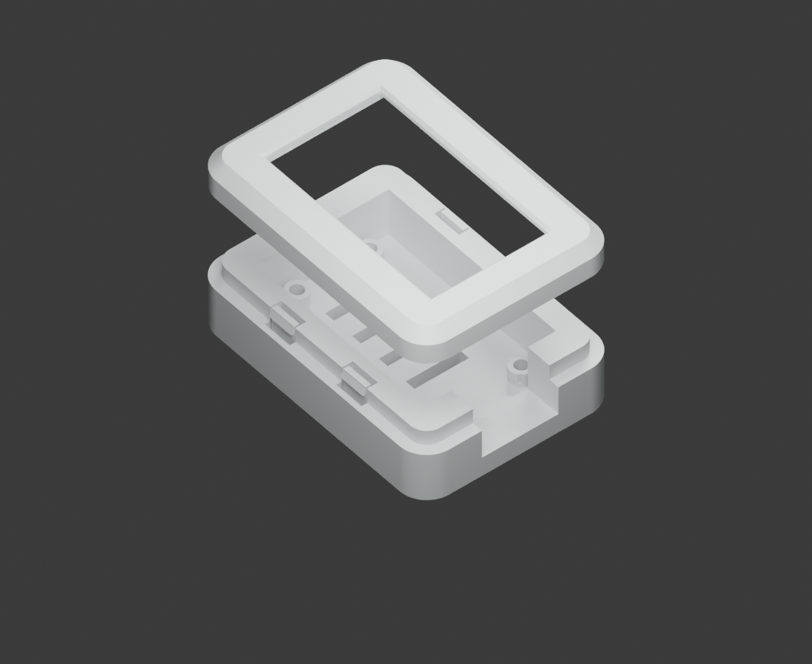

# ESP32-S3-LCD-1.47B snap-fit monitor pod

The S3 now uses the C6 design: a **42 x 56 mm rounded outline**, 5 mm corner
radius, 2 mm front chamfer, recessed locating lip and four spring catches.
Its **12.5 mm depth** follows the measured S3 stack (C6: 15.1 mm).
The outer sides and front are continuous; USB exits through the rear tray.




For the **ESP32-S3-LCD-1.47B**, non-touch 172 x 320 board without headers.
This is an unprinted fit-check prototype. The existing C6 geometry is preserved.

## Dimensions and board retention

| Feature | Millimetres |
|---|---|
| Body | 42 x 56 x 12.5 |
| PCB envelope | 20.32 x 36.37 |
| Pocket / front aperture | 21.32 x 37.37 |
| Floor / installed insulating support pad | 2.8 / 0.5 |
| User-measured support feet to glass top | 7.7 |
| Nominal glass top / rim underside | Z = 11.0 / 11.3 |
| Rear seam / locating lip top | Z = 6.9 / 9.7 |
| Locating lip / socket | 38 x 52 / 38.5 x 52.5 |
| Front rim / aperture chamfer | 1.2 / 0.5 |
| USB tunnel | 14 wide; Z = 3.6..9.9 |

The aperture uses the full PCB envelope plus 0.5 mm per side because glass
outline and offset are not dimensioned in the manufacturer drawing. It does
not clamp or positively retain the board. Use removable insulating adhesive
on the actual support feet outside the vents, with a measured installed thickness of 0.5 mm.
Do not bond components, antenna, flex or glass. Feet positions and underside
component clearance still require a physical fit check; no screw pattern is assumed.

Internal button pockets allow the user-measured approximately 1.5 mm lateral
protrusion, 0.5 mm board float and 0.5 mm clearance. They span the USB-adjacent
PCB edges to Y = -7 and Z = 2.8..11.3. Actual button Y/Z bounds remain unmeasured.
Open the housing for BOOT/RESET or microSD service, as with the C6 closed sides.
USB plug dimensions and insertion clearance must be checked with the actual cable.

## Shared monitor and desktop mounts

Use the unchanged [monitor arm and desktop stand](../mounts/README.md) on either
board enclosure. Both have four **10 x 2 mm rectangular vents**, X = -5..5,
lower Y edges **-8, -2, 4, 10**, 6 mm pitch, through a **2.8 mm floor**.
The arm engages the first and last vents, 18 mm apart. Its 2.6 mm tips stop
0.2 mm before the floor's inner surface. The middle two vents remain open,
and the shoulders maintain the 4 mm air gap. No adapter change is required.

Print the mount's grip coupons first. Detach the mount before releasing the
bezel. Depress the four catches through the rear release slots and gently lift
the front; never pull the catches through their pockets without releasing them.
The S3's shorter snap beams need a physical force/durability check.

## Printing and verification

Print `clearance-tray.stl` floor-down and `front-bezel.stl` face-down; supplied
meshes already have those orientations. Matching STEP and `s3b-monitor-tray.FCStd`
retain assembly coordinates. Start with 0.2 mm layers, four walls and 20–30%
infill. Inspect USB bridging, snap pockets and release slots in the slicer.

```powershell
& 'C:\Program Files\FreeCAD 1.1\bin\python.exe' hardware/enclosure/esp32-s3-lcd-1.47b/build_enclosure.py
& 'C:\Program Files\FreeCAD 1.1\bin\python.exe' hardware/enclosure/verify_enclosures.py
& 'C:\Program Files\Blender Foundation\Blender 5.0\blender.exe' -b --python hardware/enclosure/esp32-s3-lcd-1.47b/render_preview.py
```

Validation checks released STEP/STL/FCStd agreement, single solids, closed
manifold meshes, zero assembled overlap, nominal glass/button clearance,
removal after catch release, identical vents and both actual mount arms.
CAD checks do not establish printed retention, thermal performance or real board fit.
The screen/face in previews is illustrative.

Sources: [manufacturer drawing](../../references/manufacturer/esp32-s3-lcd-1.47b/dimensions.jpg),
[component photo](../../references/manufacturer/esp32-s3-lcd-1.47b/components.jpg),
[reference manifest](../../references/MANIFEST.md). Stack height and button
protrusion use the recorded user measurements; remaining allowances are design assumptions.
