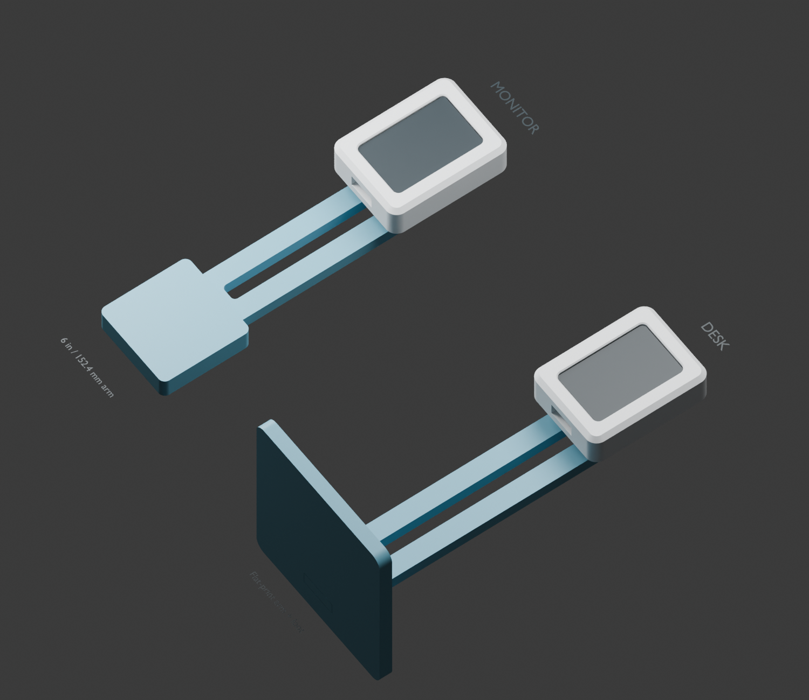
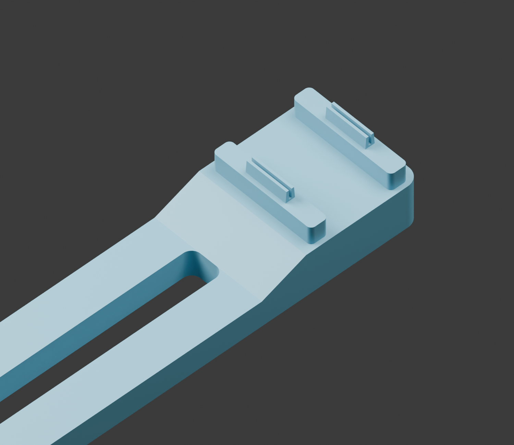

# Monitor and desk mount prototypes

These fit both the C6 and S3 rear trays' identical 10 x 2 mm vents. All dimensions
are millimetres. CAD-checked, **not yet print-tested**. The mounts carry the
small AgentPing pod; the monitor arm bonds down the back of a monitor.



## Parts

| Part | Purpose / dimensions |
|---|---|
| `monitor-arm.stl` | 152.4 mm (6 inch) long, 26 wide stem, 6 thick; solid 42 x 42 mm rounded-square adhesive pad at bottom |
| `desk-arm.stl` | Same arm plus 6 mm tongue to engage the foot |
| `desk-foot.stl` | 80 x 85 x 6 platform; projects toward display, forming an L |
| `fit-tab-1.98.stl`, `fit-tab-2.06.stl`, `fit-tab-2.14.stl`, `fit-tab-2.16.stl` | Single-tab fit coupons, labelled by nominal grip thickness in filename |

Both arms have a 7.8 mm wide through-slot (30% wider than the original 6 mm)
for easier USB connector routing. Leave
a slack loop between the enclosure's bottom USB port and the slot. Check
your cable diameter and bend radius. Small cable ties can secure the cable
around the rails. The monitor cable slot stops 46 mm above the bottom,
leaving a 4 mm gap before the solid 42 x 42 mm adhesive pad. The pad has
3 mm corner radii and provides approximately 17.6 cm² of uninterrupted
bonding surface. Its bonding face projects 4 mm from the tab-facing side of
the arm (10 mm total pad thickness); the opposite rear face remains flat.
Overall arm length remains 6 inches.

On both arms, the cable slot ends 10 mm below the tab plate. This solid neck
includes a 10 mm ramp into the raised plate, eliminating the abrupt stacked
edge. The plate and arm share the same width and 3 mm top corner radii.



The raised vent shoulders provide a 4 mm air gap between the housing and
adapter plate, putting the rear housing surface 8 mm ahead of the riser's
front face. Only the two narrow shoulder rails contact the housing. Both
arms include the plate, shoulders and tabs as one continuous printed solid.
No adapter screws or nuts are needed. Tab insertion depth remains 2.6 mm.
The desk foot remains a separate flat-print part.

## Assembly and fit

1. Print the fit coupons first, keep each identified, and test gently in an
   empty rear tray. Start with 1.98, then 2.06, 2.14 and 2.16. Choose the smallest
   that holds firmly without visibly distorting the tray. The adapter defaults
   to 2.16 mm, increased by 0.1 mm for a tighter fit (0.08 mm nominal interference
   per side in the 2 mm vent). Change `TAB_GRIP` in the generator and regenerate if needed.
   These are friction fits, not undercut latches; pull-out force is unverified.
2. Press both integrated tabs straight into the lowest and highest vents (18 mm centre
   spacing). The two raised shoulders seat on the back exterior. Tab tips extend 2.6 mm
   into the 2.8 mm floor, leaving 0.2 mm nominal clearance to its inner surface.
   The adapter and arm are solid beneath the middle two vents; the 4 mm riser
   gap provides an air path between the housing and plate. Cooling with the
   added mount has not been measured.
3. Monitor: run the arm downward behind the monitor. Apply suitable removable
   adhesive to the raised, tab-facing surface of the solid square bottom pad.
   Check the monitor's contour and pod position before bonding; no monitor
   thickness or shape has been assumed in the CAD.
4. Desk: insert the arm tongue into the foot until both shoulders seat.
   The foot extends mainly toward the screen. Its mortise has 0.15 mm clearance
   per side; this is an assembly fit, **not a positive lock**. After dry-fitting,
   bond the tongue into the foot with adhesive appropriate to the filament.
   Add non-slip pads. Check resistance to tipping with your actual cable attached.

## Printing

The STL files already have print orientations. Arms lie on their broad rear
faces with integral tabs pointing up (16.6 mm overall height); the foot is
6 mm high. Inspect the cable slot in the slicer, and use local support if needed. Keep support out of
the tab splits. Coupons print base-down with tabs pointing up, matching the
integrated tabs' layer orientation. Confirm grip again on the finished mount.
Use a brim if needed. Start with 0.2 mm
layers, four perimeters and 30% infill. Material, printer accuracy and creep
affect the grip; do not treat the coupon sizes as guaranteed tolerances.

## Reproduce

```powershell
& 'C:\Program Files\FreeCAD 1.1\bin\python.exe' hardware/enclosure/mounts/build_mounts.py
& 'C:\Program Files\Blender Foundation\Blender 5.0\blender.exe' -b --python hardware/enclosure/mounts/render_preview.py
```

Matching STEP files and `mounts.FCStd` retain assembled coordinates. The CAD
document includes alternative arms and coupons together; hide unused parts
when inspecting an assembly. `preview-geometry` contains assembled-coordinate
render meshes, not print meshes. `validation.json` records solid/mesh checks,
assembly clearances and nominal dimensions. Validation does not establish
spring force, retention, stiffness, stability or printability on your printer.

Run `hardware/enclosure/verify_enclosures.py` with FreeCAD Python to check both
released arms against both board enclosures, including vent alignment, intentional
press-fit interference, a clear riser air gap, a solid mount plate, and 0.2 mm tip-to-inner-floor clearance.
Remove the arm before accessing the rear bezel-release slots.
