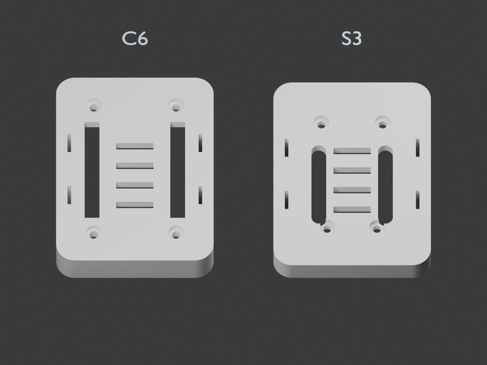
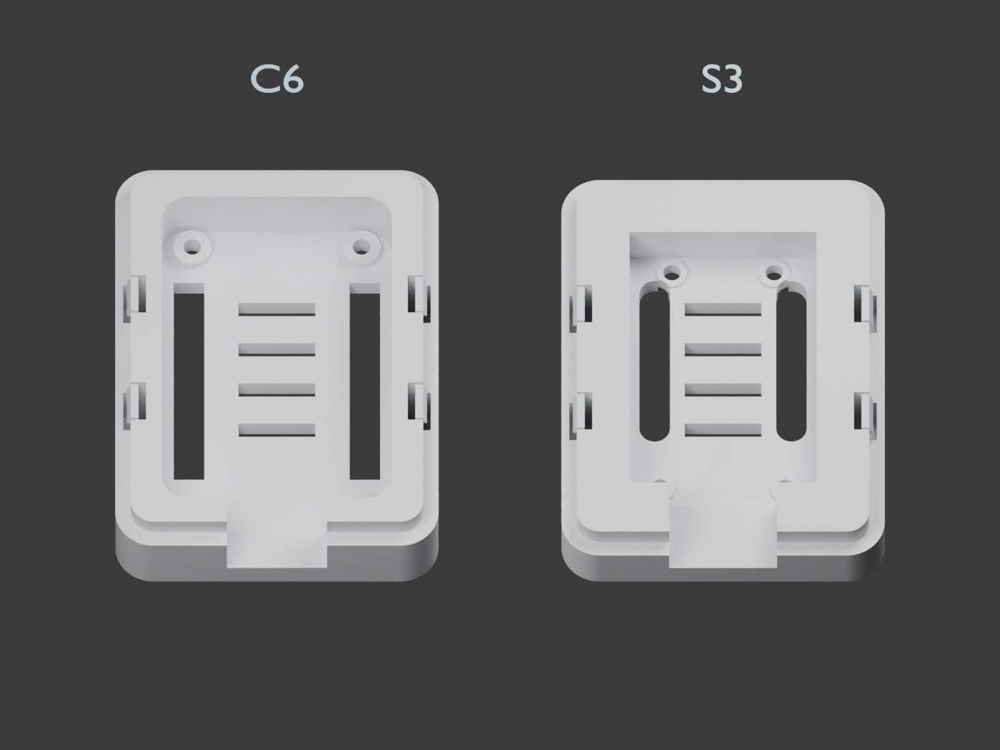

# Optional rear housings with pin-access slots

Print one of these backs **instead of** the standard back when rear-facing
GPIO headers are fitted. Reuse the original front, snap catches and mounts.
Two slots expose each board's header rows through the rear floor; the pins
are intended to remain recessed rather than stick out behind the case.
These are unprinted fit-check options, not verified fits to soldered headers.



| Board | Optional back | Header layout used | Two rear slots |
|---|---|---|---|
| ESP32-C6-Touch-AMOLED-1.64 | [back-cover-pin-access.stl](../esp32-c6-touch-amoled-1.64/back-cover-pin-access.stl) | 11 pins per row; 2.54 mm pitch; 22.86 mm between rows | 4 x 29.4 mm |
| ESP32-S3-LCD-1.47B | [clearance-tray-pin-access.stl](../esp32-s3-lcd-1.47b/clearance-tray-pin-access.stl) | 9 pins per row; 2.54 mm pitch; 17.78 mm between rows | 4 x 24 mm, rounded ends |

Matching STEP files and `pin-access.FCStd` are beside each STL. Each FreeCAD
document contains the optional rear and the unchanged original front, in
assembled coordinates. STL files are floor-down, ready for slicing.

## Recessed pins and the existing mounts

The exterior housing size, board seating height, USB/button clearance and all
four **10 x 2 mm vents** remain unchanged. Slots are entirely outside the vent
pattern. The minimum material between a slot and the vents is **4.43 mm on C6**
and **1.89 mm on S3**. Snap-release openings are untouched. The S3 now has printed support pads in
both back options; rounded slot ends preserve at least 0.5 mm of continuous
material around the M2 clearance holes above the rear head recesses.

The available distance from the board's support feet to the exterior rear plane is:

- **C6: 4.3 mm** = 1.5 mm printed lift + 2.8 mm floor.
- **S3: 3.3 mm** = 0.5 mm printed supports + 2.8 mm floor.

A header pin extending less than that distance behind the support feet remains
recessed. These numbers are limits, not measured pin lengths. Check the actual
soldered headers with a straightedge across the back before attaching a mount.
The slot passes through the floor so a suitable narrow connector can reach a
recessed pin; usable mating depth depends on the fitted pin and connector.
The 4 mm width allows a nominal 2.54 mm-wide header body plus 0.73 mm per side.
Larger socket housings are not covered by this envelope.

Use the existing [monitor/desktop mounts](../mounts/README.md) as supplied.
CAD checks confirm no collision with header envelopes at or inside rear Z = 0.
Their shoulders overlap the slot entrances outside the housing, so remove the
mount to connect leads. Simultaneous use of rear plugs and the mount is not
claimed. No alternate arms or adapters are needed for recessed bare pins.

Both boards fasten through the rear with M2 screws into the metal standoffs.
The S3 backs now provide four 0.5 mm-high printed pads instead of adhesive
supports; see its [assembly instructions](../esp32-s3-lcd-1.47b/README.md) for
the manufacturer-dimensioned screw positions and 2.0 mm screw grip. The board
stack and existing front stay unchanged. Check screw length against actual threads.

## Coordinates and evidence

Coordinates match the standard housing: board centre X/Y, USB toward -Y,
rear exterior Z = 0, screen toward +Z.

| Board | Slot centre X | Slot Y limits | First/last pin centre Y |
|---|---|---|---|
| C6 | +/-11.43 | -14.42 to +14.98 | -12.42 to +12.98 |
| S3 | +/-8.89 | -8.715 to +15.285 | -6.875 to +13.445 |

C6 positions come from the archived [manufacturer dimension drawing](../../references/manufacturer/ESP32-C6-Touch-AMOLED-1.64-dimensions-20241221.pdf):
43.5 mm PCB length, 9.33 mm lower edge to first pin, and 25.4 mm span across
11 pins. This older drawing is a provisional header-location reference; the
existing user-measured 22 x 39 mm screw pattern and 9.3 mm module stack remain
authoritative for the housing. Check the rows against the actual board revision.
The carrier's older 1x10 socket footprints are not used for these slots.

S3 positions come from the [manufacturer dimensioned image](../../references/manufacturer/esp32-s3-lcd-1.47b/dimensions.jpg):
36.37 mm PCB length, 11.31 mm USB edge to nearest pin, nine pins per row.
Sources and limits are also recorded in [the reference manifest](../../references/MANIFEST.md).



The S3 slots have 2 mm-radius semicircular ends to clear the nearby antenna-end
supports. Their nominal header-body corners clear in CAD; real connector shapes
and print tolerances still require checking.

## Reproduce and verify

```powershell
& 'C:\Program Files\FreeCAD 1.1\bin\python.exe' hardware/enclosure/pin-access/build_pin_access.py
& 'C:\Program Files\FreeCAD 1.1\bin\python.exe' hardware/enclosure/verify_enclosures.py
& 'C:\Program Files\Blender Foundation\Blender 5.0\blender.exe' -b --python hardware/enclosure/pin-access/render_preview.py
```

`build_pin_access.py --check` checks the released optional files without
regenerating them. The main enclosure verifier includes the optional variants.
Checks cover single valid solids, closed connected manifold meshes, STEP/STL/
FreeCAD agreement, exact subtraction of two slots, nominal header clearance,
unchanged vents and compatibility with both original mount arms and fronts.
`validation.json` records the dimensions and results. The standard C6 files and generator are preserved. The standard S3 back is
also regenerated with the same four printed pads and M2 screw access.

Use the original printing guidance: 0.2 mm layers, four walls, floor-down rear.
Inspect the 1.89 mm S3 webs in the slicer. Physical print tolerances, actual pin
recess, mating-connector fit and retention still require a first-print check.
